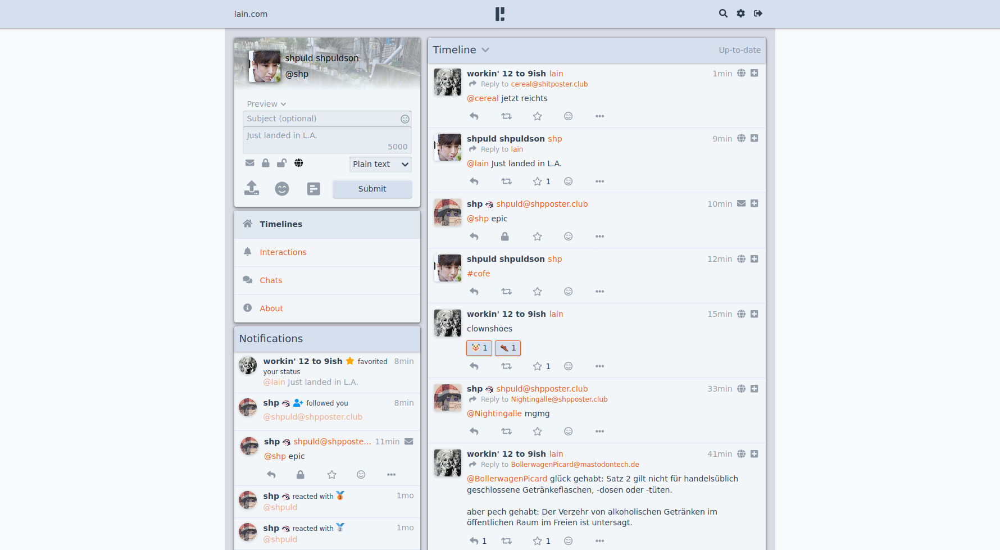

# Pleroma CI/CD pipeline

Deploy Pleroma server with CI/CD on Elestio

 
 

# Once deployed ...

You can open Pleroma UI here:

    URL: https://[CI_CD_DOMAIN]
    email: [ADMIN_EMAIL]
    password: [ADMIN_PASSWORD]

You can open pgAdmin web UI here:

    URL: https://[CI_CD_DOMAIN]:49371
    email: [ADMIN_EMAIL]
    password: [ADMIN_PASSWORD]
